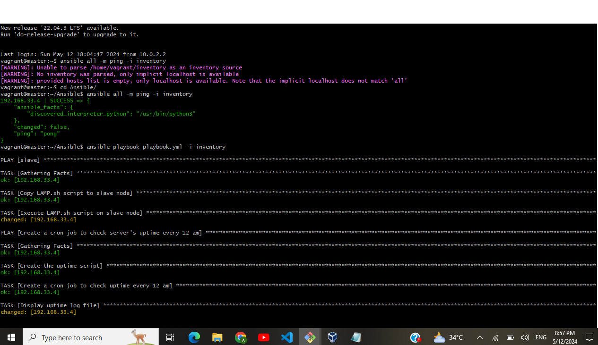

# 3MTT Cloud Engineering – Beginner Module Assessment
### (Deploy LAMP Stack)
## Objective
- Automate the provisioning of two Ubuntu-based servers, named “Master” and “Slave”, using Vagrant.
- On the Master node, create a bash script to automate the deployment of a LAMP (Linux, Apache, MySQL, PHP) stack.
- This script should clone a PHP application from GitHub, install all necessary packages, and configure Apache web server and MySQL. 
- Ensure the bash script is reusable and readable.
- Using an Ansible playbook:
1. Execute the bash script on the Slave node and verify that the PHP application is accessible through the VM’s IP address (take screenshot of this as evidence)
2. Create a cron job to check the server’s uptime every 12 am.


## Introduction
To complete this assessment, my knowledge of Bash scripting and Ansible were put to the test.

A bash script is a series of commands written in a file. These are read and executed by the bash program. The program executes line by line. For example, you can navigate to a certain path, create a folder and spawn a process inside it using the terminal. 

Ansible is an open source, command-line IT automation software application written in Python. It can configure systems, deploy software, and orchestrate advanced workflows to support application deployment, system updates, and more.


## Steps
These are the steps I took while carrying out the project. Each step would be explained in detail.

### Setting Up Virtual Machines
- To create a Virtual Machine, Check these resources for [Ubuntu](https://ubuntu.com/tutorials/how-to-run-ubuntu-desktop-on-a-virtual-machine-using-virtualbox#1-overview)

- With the virtual machine ready, we go ahead with creating two Ubuntu servers named "master" and "slave". To do this, i created two folders named master and slave, then i started git bash from both folders like below:

- Next is to Initialize your master Ubuntu machine. After opening the "master" folder with git bash, run:
```
vagrant init Ubuntu/focal64
```


Open the `Vagrantfile` and make some edits to the configuration file using the command `nano vagrantfile`. This or similar should appear:


- There is a need to make some changes to fit our needs in the vagrant file. I added the following lines in the vagrant file:
```
# Provision master Node
config.vm.define "master" do |master|
master.vm.box = "ubuntu/focal64"
master.vm.hostname = "master"
master.vm.network "private_network", ip: "192.168.33.10", type: "dhcp"
end
```
I also added config.ssh.insert_key = false under config.vm.box = ubuntu/focal64.
- The file should look like this: after adding the above:


The next step is to type and run the command `vagrant up` to start the machine.


Once it shows the above then it means the server is up and running. You are ready to ssh into the machine. Use the command `vagrant ssh` to connect the machine.


- Now that that I have logged into the "masters" virtual machine, I followed the same procedure for the "slave" virtual machine. With the only difference being the contents of the vagrant file. Which is as follows:
```
# Provision Slave Node
config.vm.define "slave" do |slave|
slave.vm.box = "ubuntu/focal64"
slave.vm.hostname = "slave"
slave.vm.network "private_network", ip: "192.168.33.11", type: "dhcp"
end
```

## Connect the "master" and "slave" machines by using ssh
- I used the command `ip a` to check for the IP address of each of the virtual machines. 
- After noting the addresses, I proceeded to generate keys. 
On the "master" Virtual Machine, I wrote ssh-keygen to generate a private & public key. When I run the command, I came across some prompts. To proceed to generate the key, I clicked on Enter key thrice. Like below:


- The steps above were repeated on the "slave" server.


- In the "master" virtual machine, change the directory into ssh with the command cd .ssh then ls to list all the files in the ssh directory. You will see something like what is below.


- Open the content of id_rsa.pub and copy it to save it somewhere for later use. That is where the public key is and that is what you are copying. I used this command to open it cat id_rsa.pub. The key would be long and look like something below.


- Get on the 'slave' server and change the directory to .ssh with the command `cd .ssh`.

- I created and opened a file in the .ssh directory of the "slave" machine at once so that the public key you copied from the "masters" machine and saved somewhere, you will paste it in the created file. I named my file 'public_key'. Run the command nano public_key and paste the public key from the "master" virtual machine here. 
- I then run the command cat public_key >> authorized_keys to copy the public keys into the authorized_keys file from the file named public in the "slave" machine. Run the command cat authorized_keys to see the content of the copied public keys of the "masters" virtual machine and the "slave" virtual machine. 
- Connect the "master" virtual machine to the "slave" virtual machine by using ssh to connect the IP address of the "slave" machine to the "master" machine. First of all, run the command ip a to know the IP addresses in each machine. Then run the command ssh vagrant@slave ip in the "master" virtual machine. It should look like this ssh vagrant@192.168.33.4 


## Creating the Bash Script and Ansible to automate the provisioning of the two Ubuntu-based Virtual Machines we've created.

In my "master" virtual machine, I created the script that will automate the deployment of LAMP (Linux, Apache, MySQL, PHP) stack.

- I named the script LAMP with the .sh extension. I used the command `touch LAMP.sh` to create the script. 
- Run `nano LAMP.sh` to open the file script to write the script. The content of the script is as below:
```
#!/bin/bash

# Define variables for paths and IP address
LARAVEL_DIR="/var/www/html/laravel"
LARAVEL_CONF="/etc/apache2/sites-available/laravel.conf"
VIRTUAL_HOST="192.168.33.4"

# Update all package index and upgrade packages
sudo apt update
sudo apt upgrade -y
echo "Done with upgrade package"

# Update the PHP repository
sudo add-apt-repository -y ppa:ondrej/php
echo "Done with php repo update"

# Install Apache
sudo apt install -y apache2
sudo systemctl enable apache2
echo "Done with Apache installation"

# Install MySQL
sudo debconf-set-selections <<< 'mysql-server mysql-server/root_password password'
sudo debconf-set-selections <<< 'mysql-server mysql-server/root_password_again password'
sudo apt install -y mysql-server
echo "Done with MySQL installation"

# Install PHP 8.2 and 8.3 with necessary extensions
sudo apt install -y php libapache2-mod-php php-mysql php8.2 php8.2-curl php8.2-dom php8.2-xml php8.2-mysql php8.2-sqlite3 php8.3 php8.3-curl php8.3-dom php8.3-xml php8.3-mysql php8.3-sqlite3
echo "Done with PHP 8.2 and 8.3 installation"

# Run MySQL secure installation
expect <<EOF
spawn sudo mysql_secure_installation
expect "Would you like to setup VALIDATE PASSWORD component?"
send "y\r"
expect {
    "Please enter 0 = LOW, 1 = MEDIUM and 2 = STRONG" {
        send "1\r"
        exp_continue
    }
    "Remove anonymous users?" {
        send "y\r"
        exp_continue
    }
    "Disallow root login remotely?" {
        send "n\r"
        exp_continue
    }
    "Remove test database and access to it?" {
        send "y\r"
        exp_continue
    }
    "Reload privilege tables now?" {
        send "y\r"
        exp_continue
    }
}
EOF
echo "Done with MySQL secure installation"

# Restart Apache
sudo systemctl restart apache2
echo "Done with Apache restart"

# Install Git
sudo apt install -y git
echo "Done with Git installation"

# Clone Laravel repository
sudo git clone https://github.com/laravel/laravel $LARAVEL_DIR
echo "Done with cloning Laravel repository"

# Change directory to Laravel folder
cd $LARAVEL_DIR
echo "Changed directory to $LARAVEL_DIR"

# Install Composer
sudo apt install -y composer
echo "Done with installing Composer"

# Upgrade Composer to version 2
sudo php -r "copy('https://getcomposer.org/installer', 'composer-setup.php');"
sudo php -r "if (hash_file('sha384', 'composer-setup.php') === 'dac665fdc30fdd8ec78b38b9800061b4150413ff2e3b6f88543c636f7cd84f6db9189d43a81e5503cda447da73c7e5b6') { echo 'Installer verified'; } else { echo 'Installer corrupt'; unlink('composer-setup.php'); } echo PHP_EOL;"
sudo php composer-setup.php --install-dir /usr/bin --filename composer
echo "Done with upgrading Composer to version 2"

# Use Composer to install dependencies
yes | sudo composer install
echo "Done installing Composer dependencies"

# Copy Laravel configuration file and set permissions
sudo cp .env.example .env
sudo chown www-data:www-data .env
sudo chmod 640 .env
echo "Done copying Laravel configuration file and setting permissions"

# Create virtual host in /etc/apache2/sites-available
sudo tee $LARAVEL_CONF >/dev/null <<EOF
<VirtualHost *:80>
    ServerName $VIRTUAL_HOST
    ServerAlias *
    DocumentRoot $LARAVEL_DIR/public

    <Directory $LARAVEL_DIR>
        AllowOverride All
    </Directory>
</VirtualHost>
EOF
echo "Done creating virtual host in /etc/apache2"

# Generate application key
sudo php artisan key:generate
echo "Done generating application key"

# Run migrations
sudo php artisan migrate --force
echo "Done running migrations"

# Change ownership permissions
sudo chown -R www-data:www-data $LARAVEL_DIR/database/ $LARAVEL_DIR/storage/logs/ $LARAVEL_DIR/storage $LARAVEL_DIR/bootstrap/cache
echo "Done changing ownership permissions"

# Set file permissions
sudo chmod -R 775 $LARAVEL_DIR/database/ $LARAVEL_DIR/storage/logs/ $LARAVEL_DIR/storage
echo "Done setting file permissions"

# Disable default configuration file
sudo a2dissite 000-default.conf
echo "Done disabling default configuration file"

# Enable Laravel configuration file
sudo a2ensite laravel.conf
echo "Done enabling Laravel configuration file"

# Restart Apache
sudo systemctl restart apache2
echo "Done restarting Apache"


uptime > /var/log/uptime.log
```
*The Virtual_host is the IP address of my 'slave' server*.

* I used control + O to save it and control + X to exit back to terminal.

### Creating Ansible Playbook
- While in the "master" server, in created an Ansible directory cd into it using the command
```
mkdir Ansible && cd Ansible
```


- Run this command to update any dependencies. 
- Then to install Ansible run the command below.

 
- Still, in your Ansible directory, create and open your inventory using `nano inventory`. The inventory file is used to store the address of the slave nodes to be configured which will enable the playbook to run in the "slave" machine even if it is created in the "master's" machine.
- Opening the inventory file to put in the IP address of the "slave" machine. 


- Create and nano into playbook with the .yml extension.
```
nano playbook.yml
```
- I wrote the following lines in the playbook:
```
---

- hosts: slave
  become: yes
  tasks:

    # Copy LAMP.sh script to the slave node
    - name: Copy LAMP.sh script to slave node
      copy:
        src: /home/vagrant/Ansible/LAMP.sh
        dest: /home/vagrant/LAMP.sh
        mode: 0755  

      # Make the script executable

    # Execute the LAMP.sh script on the slave node
    - name: Execute LAMP.sh script on slave node
      shell: /home/vagrant/LAMP.sh


- name: Create a cron job to check server's uptime every 12 am
  hosts: slave
  become: yes
  tasks:

    # Create an uptime script that logs the server's uptime to a file
    - name: Create the uptime script
      copy:
        content: |

          #!/bin/bash

          # Log the server's uptime to a file
          uptime > /var/log/uptime.log
        dest: /usr/local/bin/check_uptime.sh
        mode: '0755'  # Make the script executable

    # Create a cron job that runs the uptime script every day at 12 am (midnight)

    - name: Create a cron job to check uptime every 12 am
      cron:
        name: Check uptime every 12 am
        job: "/usr/local/bin/check_uptime.sh"

        # Run at 12:00 am
        minute: '0'  
        hour: '0'
        state: present

    # Display the contents of the uptime log file
    - name: Display uptime log file
      shell: cat /var/log/uptime.log
      register: uptime_output

    # Display the server's uptime as captured in the uptime log file
    - name: Display the server's uptime
      debug:
        msg: "{{ uptime_output.stdout }}"

    # Task to fetch the content of the PHP application using curl
    - name: Fetch PHP application content using curl
      command: "curl -s http://192.168.33.9"  # Perform a silent HTTP GET request to the target IP address
      register: php_application  # Register the output of the curl command
      ignore_errors: true  # Continue playbook execution even if this task fails

    # Task to display the content fetched from the PHP application
    - name: Display content of PHP application
      debug:
        msg: "PHP Application Content:\n{{ php_application.stdout }}"  # Display the output of the curl command
```
Here is what it looks like:


### Created a cron job to check the server’s uptime every 12 am in my playbook.
This job can be found in the playbook. Below is a snippet from it:

- I used the command below to execute the playbook:
```
ansible-playbook playbook.yml -i inventory
```
-The output after running the command is presented below:


Finally i pasted the IP address of the 'slave' server on my browser to see that the application is accessible. Here is a screenshot of the webpage:


---

**Conclusion**

In this project, I have demonstrated an effective and reliable method for provisioning and managing servers through the automation of the LAMP (Linux, Apache, MySQL, PHP) stack deployment using a Bash script within Ansible. By streamlining the deployment process, we achieve faster and less labor-intensive setup compared to manual configurations. Moreover, the script's reusability allows easy adaptation to various environments and use cases, facilitated by parameterized variables and robust error handling.

The integration of the Bash script into an Ansible playbook further enhances automation, ensuring uniformity and repeatability across server deployments. The playbook not only establishes cron jobs to monitor server uptime but also verifies PHP application accessibility on both master and slave nodes, providing valuable insights into server performance.

Despite encountering challenges such as script errors and log file issues, diligent debugging and code adjustments resolved these issues. Ultimately, successful deployment and validation of the PHP application on the slave node's IP address underscore the effectiveness of Ansible and Bash scripting in automating complex deployment procedures.

This comprehensive documentation serves as a valuable resource for future LAMP stack deployments and similar projects, emphasizing best practices and practical solutions. 🚀

---

Feel free to make any additional adjustments or let me know if you need further assistance! 😊
